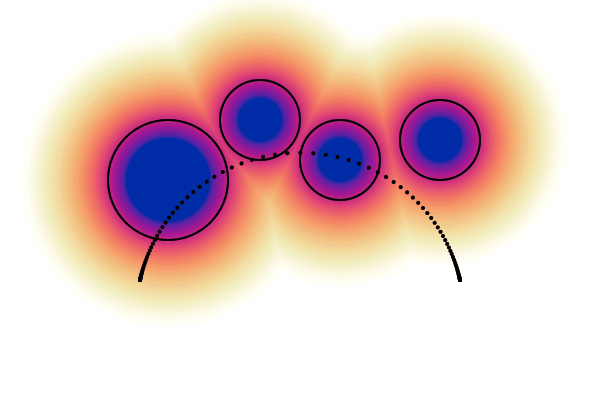

# CHOMP
## Covariant Hamiltonian Optimization for Motion Planning
**Matt Zucker, Nathan Ratliff, Anca D. Dragan, Mihail Pivtoraiko, Matthew Klingensmith,
Christopher M. Dellin, J. Andrew Bagnell, Siddhartha S. Srinivasa**

This Julia notebook studies the trajectory optimization algorithm CHOMP on a 2D robot arm example.

